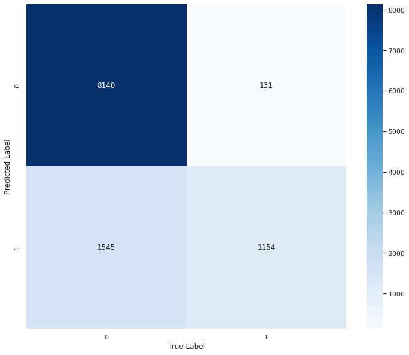

# Terry Stops Traffic

# Project Overview

Terry Stops, initiated by law enforcement officers based on reasonable suspicion, may sometimes involve consideration of the perceived race of the individual. However, it's essential to underscore that race alone should not serve as the sole justification for a Terry Stop, as such actions could be discriminatory and infringe upon an individual's constitutional rights.

The concept of investigative detention, established in Terry v. Ohio and further developed over the past five decades, has been extensively scrutinized, commended, and criticized from various angles.

The incorporation of perceived race into Terry Stops has sparked controversy, prompting discussions about racial profiling and the potential for racial bias in law enforcement practices. It is imperative for law enforcement agencies to train their officers to base stops on reasonable suspicion rather than solely relying on race as a determining factor.

# Business Understanding

The objective of this project is to develop a predictive model that aids law enforcement agencies in making well-informed decisions during Terry Stops. By leveraging information on various factors such as the presence of weapons, the timing of the stop, and the gender and race of both the officer and the subject, the classifier can assist officers in gauging the likelihood of an arrest. This initiative aims to enhance the efficiency and impartiality of law enforcement actions, potentially mitigating instances of false arrests and misconduct.

However, the utilization of gender and race data raises substantial ethical concerns, as they have the potential to perpetuate bias and discrimination. Therefore, it is imperative to approach this problem with careful consideration and sensitivity.

# Data Understanding

This data represents records of police reported stops under Terry v. Ohio, 392 U.S. 1 (1968). Each row represents a unique stop. Data provided by City of Seattle and Dataset Owner spd2internetData There are 54.9K rows and 23 Columns.

http://www.seattle.gov/police

This dataset comprises records of police-reported stops conducted under Terry v. Ohio, 392 U.S. 1 (1968). Each row represents a distinct stop, containing perceived demographic information about the subject as reported by the officer initiating the stop, along  with demographic details of the officer reported to the Seattle Police Department for employment purposes. Additionally, the dataset includes data elements from the corresponding Computer Aided Dispatch (CAD) event, such as Call Type, Initial Call Type, and Final Call Type, wherever available.

# Features

Subject Age Group - Subject Age Group (10 year increments) as reported by the officer.

Subject ID - Key, generated daily, identifying unique subjects in the dataset using a character to character match of first name and last name. "Null" values indicate an "anonymous" or "unidentified" subject. Subjects of a Terry Stop are not required to present identification.

GO / SC Num - General Offense or Street Check number, relating the Terry Stop to the parent report. This field may have a one to many relationship in the data.

Terry Stop ID - Key identifying unique Terry Stop reports.

Stop Resolution - Resolution of the stop as reported by the officer.

Weapon Type - Type of weapon, if any, identified during a search or frisk of the subject. Indicates "None" if no weapons was found.

Officer ID - Key identifying unique officers in the dataset.

Officer YOB - Year of birth, as reported by the officer.

Officer Gender - Gender of the officer, as reported by the officer.

Officer Race - Race of the officer, as reported by the officer.

Subject Perceived Race - Perceived race of the subject, as reported by the officer.

Subject Perceived Gender - Perceived gender of the subject, as reported by the officer.

Reported Date - Date the report was filed in the Records Management System (RMS). Not necessarily the date the stop occurred but generally within 1 day.

Reported Time - Time the stop was reported in the Records Management System (RMS). Not the time the stop occurred but generally within 10 hours.

Initial Call Type - Initial classification of the call as assigned by 911.

Final Call Type - Final classification of the call as assigned by the primary officer closing the event.

Call Type - How the call was received by the communication center.

Officer Squad - Functional squad assignment (not budget) of the officer as reported by the Data Analytics Platform (DAP).

Arrest Flag - Indicator of whether a "physical arrest" was made, of the subject, during the Terry Stop. Does not necessarily reflect a report of an arrest in the Records Management System (RMS).

Frisk Flag - Indicator of whether a "frisk" was conducted, by the officer, of the subject, during the Terry Stop.

Precinct - Precinct of the address associated with the underlying Computer Aided Dispatch (CAD) event. Not necessarily where the Terry Stop occurred.

Sector - Sector of the address associated with the underlying Computer Aided Dispatch (CAD) event. Not necessarily where the Terry Stop occurred.

Beat - Beat of the address associated with the underlying Computer Aided Dispatch (CAD) event. Not necessarily where the Terry Stop occurred.

# Objectives

Develop a classifier capable of predicting the outcome of a Terry Stop (whether an arrest was made or not) using factors including the presence of weapons, the time of the call, and potentially the gender and race of both the officer and the subject.

# Project Plan

1.Data Preparation - Loading Libraries - Loading data - Descriptive Exploration - Data Cleaning - Exploratory Descriptive Analysis (EDA) - Pre-processing Data

2.Modelling - Train test split - Models- Evaluation

3.Conclusion

4.Recommendation

# Modelling

Logistic Regression - baseline Model
Cross validation scores: 84.7402
The baseline model was correct 84.74 % most of the time in its classification.

Random Forest Classifier
rfc_model Accuracy: 84.5305
The Random Forest classifier was correct 84% in its classification most of the time.

Suport Vector Machine
Cross validation scores: [0.8573382  0.84639927 0.83956244 0.83956244 0.83409298]
The SVC model was correct 84.34% most of the time

# Evaluation

Recall, f1 score, precision accuracy. By use of confusion matrix I came to the following conclusion

7851 observations were correctly predicted as 0 (True Negatives)
358 observations were incorrectly predicted as 1 (False Positives)
1142 observations were incorrectly predicted as 0 (False Negatives)
1619 observations were correctly predicted as 1 (True Positives)

# Conclusion

In summary, the outcomes of this project suggest that machine learning models are valuable tools for analyzing Terry stop data and predicting resolution arrests. The model has effectively pinpointed the key features essential for making accurate predictions, offering valuable insights for policymakers and law enforcement agencies. However, it's essential to recognize that this analysis represents only a portion of the overall assessment, and additional investigation may be necessary to obtain a more comprehensive understanding of the dataset.

## 8. Recommendations

1. **Officer Training:** Train officers on the appropriate circumstances for making arrests during Terry Stops, as this is a key factor in predicting arrests. Ensure that the officer's precinct is recorded for all Terry Stops to improve arrest prediction accuracy. Additionally, educate officers on the appropriate situations for conducting frisks, another significant predictor of arrests.

2. **Address Data Biases:** The model's predictions might be influenced by biases present in the data, such as those based on race, gender, or location. Identifying and addressing these biases is crucial to ensure the model provides fair and unbiased predictions.

**Next Steps:**
While an 84% accuracy rate is decent, there is room for improvement. Enhancing the model's accuracy could involve further data cleaning or adjusting the model inputs. Exploring other classification models, such as deep learning models, could also yield more accurate predictions.

**Further Data Analysis:** Although the machine learning model has identified the most important features for predictions, additional analysis is necessary to gain a deeper understanding of the data and uncover any potential biases or correlations between features.

In conclusion, the Terry Stop project has demonstrated the potential for using machine learning models to analyze Terry Stop data. However, it is essential to continuously monitor and evaluate the model's performance to ensure it remains accurate and relevant over time.